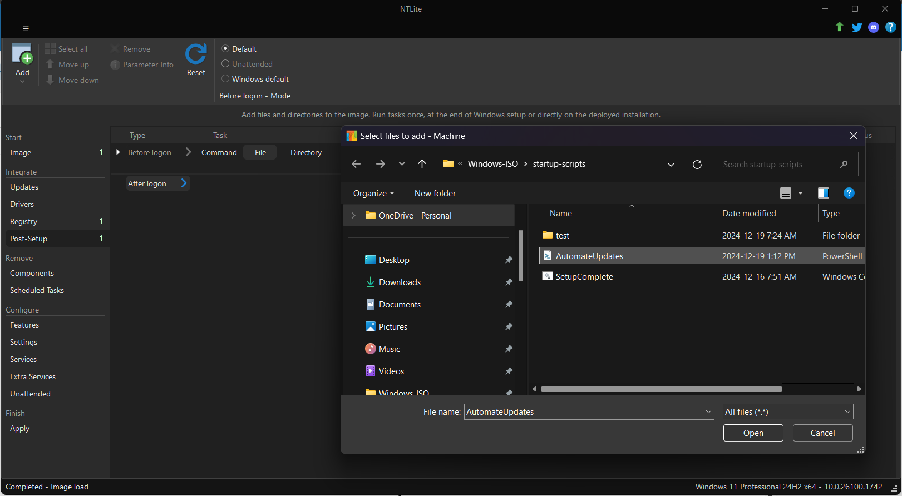
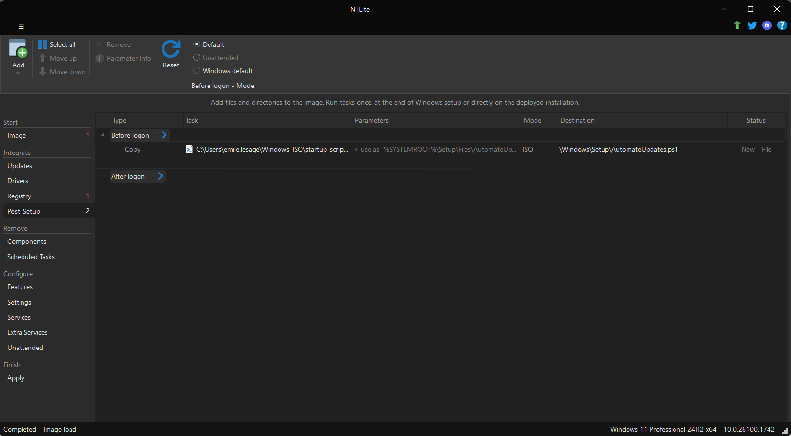
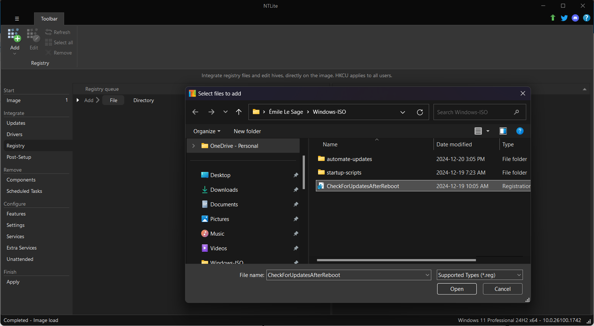

# Automatisation des mises à jour Windows

### 1. Préparation de l'image Windows avec NTLite :

##### 1.1 Ajout du Script `AutomateUpdates.ps1`

##### 1.2 Changé les paramètres du fichier `AutomateUpdates.ps1`

1. 1. 1. Changé le Type `Run` → `Copy`
        2. Changé la Destination `\Windows\Setup\Files\AutomateUpdates.ps1` → `\Windows\Setup\AutomateUpdates.ps1`

##### 1.3 Ajouter la clé de registre

Commande utilisé pour générer la clé de registre

Set-ItemProperty -Path "HKLM:\\Software\\Microsoft\\Windows\\CurrentVersion\\RunOnce" -Name "CheckForUpdatesAfterReboot" -Value "Powershell.exe -ExecutionPolicy Bypass -File C:\\Windows\\Setup\\AutomateUpdates.ps1"

- - Cette clé de registre permet l'exécution automatiques du script `AutomateUpdates.ps1` après le premier démarrage.

### 2. Fonctionnement du script AutomateUpdates.ps1 :

- À chaque redémarrage, le script vérifie les mises à jour Windows, les installe et configure les redémarrages nécessaires jusqu’à ce que toutes les mises à jour soient appliquées.
- Une fois le système à jour, le script s’auto supprime pour nettoyer l’environnement.

### Avantages :

- Automatisation complète des mises à jour Windows sans intervention manuelle.
- Logs détaillés dans le fichier `C:\Windows\Setup\Files\AutomateUpdates.log` pour suivre chaque étape et identifier les éventuelles erreurs.
- Maintenance réduite grâce à la suppression automatique du script une fois le processus terminé.
